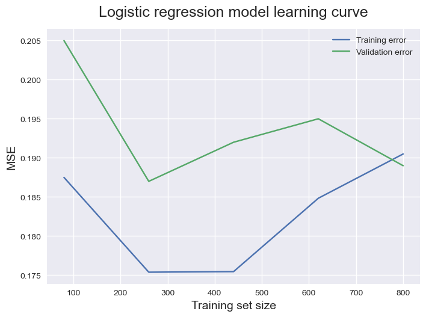

# Logistic Regression Model

## Model deployment with Sklearn package 
The steps that we perform throughout model training and evaluation:
### a. Data preparation
- Split model into train, test, split
- Perform feature scaling
### b. Model buidling
- SGD Classifier
- Logistic Regression

=> Perform polynominal feature selection for both models, and compare MSE of cross validation set to choose the best model

### c. Model selection
- Use ROC curve to demonstrate:
    - The tradeoff between sensitivity and specificity
    - The closer the ROC curve follows the left-hand border and the top border, the more accurate the model
    - The larger the area under ROC, the better the model

### Results: 
- On comparing LogisticRegression and SGDClassifier for this dataset, LogisticRegression gives a bigger ROC area under the curve. So, we choose LogisticRegression

- The best model is Logistic Regression, polynomial feature of degree 1 and the reported MSE is 0.09 (a 2.5% degree in MSE)

### d. Diagnose performance using learning curve
- The following learning curve calculated using the training dataset to give an idea of how well the model is learning

### Results: 
- The model has high bias problem
- The gap for the training and validation curve becomes extremely small as the training dataset size increases. This indicates that adding more examples to our model is not going to improve its performance. 

### To fix high bias problem:
- Add more features
- Decrease regularization 
