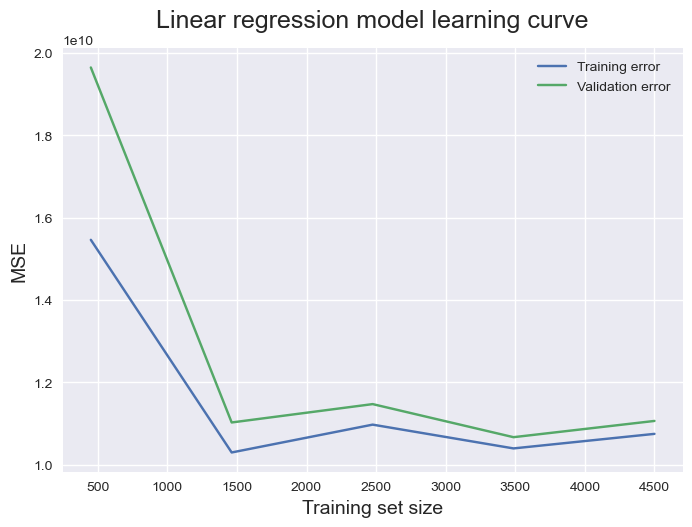

# Linear Regression Model

## 1.  Batch Gradient Descent algorithm
### a. Model: 
$$ f_{\mathbf{w},b}(\mathbf{x}) = \mathbf{w} \cdot \mathbf{x} + b $$

### b. Cost function:
$$J(\mathbf{w},b) = \frac{1}{2m} \sum\limits_{i = 0}^{m-1} (f_{\mathbf{w},b}(\mathbf{x}^{(i)}) - y^{(i)})^2 + \frac{\lambda}{2m}  \sum_{j=0}^{n-1} w_j^2$$ 

### c. Gradient descent: 
Repeat until convergence: 

$$\begin{align*}
w_j = w_j -  \alpha \frac{\partial J(\mathbf{w},b)}{\partial w_j} \\ 
b = b -  \alpha \frac{\partial J(\mathbf{w},b)}{\partial b}
\end{align*}$$

where: 
* n is the number of features
* $w_j$ and $b$, are updated simultaneously and

$$\begin{align*}
\frac{\partial J(\mathbf{w},b)}{\partial w_j}  &= \frac{1}{m} \sum\limits_{i = 0}^{m-1} (f_{\mathbf{w},b}(\mathbf{x}^{(i)}) - y^{(i)})x_{j}^{(i)}  +  \frac{\lambda}{m} w_j\\
\frac{\partial J(\mathbf{w},b)}{\partial b}  &= \frac{1}{m} \sum\limits_{i = 0}^{m-1} (f_{\mathbf{w},b}(\mathbf{x}^{(i)}) - y^{(i)})
\end{align*}$$

## 2. Model deployment with Sklearn package 
The steps that we perform throughout model training and evaluation:
### a. Data preparation
- Split model into train, test, split
- Perform feature scaling
### b. Model buidling
- SGD Regresssor
- Linear Regression

Perform polynominal feature selection for both models, and compare MSE of cross validation set to choose the best model

### c. Model selection

- On comparing MSE of LinearRegression and SGDRegressor on cross validation set, LinearRegression gives a smaller MSE

- The best model is Linear Regression, polynomial feature of degree 3.

### d. Diagnose performance using learning curve

- The following learning curve calculated using the training dataset to give an idea of how well the model is learning

### Results: 
- The model has both high bias and high variance problem
- The gap for the training and validation curve becomes mall as the training dataset size increases. This indicates that adding more examples to our model is not going to improve its performance. 
- The training MSE is very high, which indicates a high variance problem

### To fix these problems,
- Add more features
- Train different models